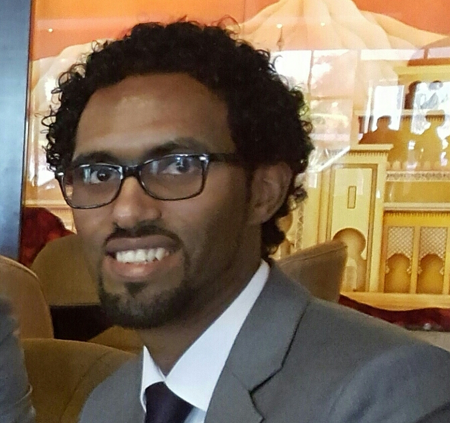

# About Me

| :---         |     :---     |
|    | My name is Tesfagabir Meharizghi. I am a PhD student in Computer Science at [Florida International University](https://www.cis.fiu.edu). My research interests is machine learning/deep learning. I worked on different types of datasets such as remote sensing environmental data, genomic data, 3D MRI data, etc. Currently I am working on a project that uses both MRI scans of tumor patients and their associated genomic data. I am very passionate on applying the state-of-the-art developments on the field machine learning/deep learning.     |

 My name is Tesfagabir Meharizghi. I am a PhD student in Computer Science at [Florida International University](https://www.cis.fiu.edu). My research interests is machine learning/deep learning. I worked on different types of datasets such as remote sensing environmental data, genomic data, 3D MRI data, etc. Currently I am working on a project that uses both MRI scans of tumor patients and their associated genomic data. I am very passionate on applying the state-of-the-art developments on the field machine learning/deep learning.

If you want to know more or collaborate, you can [contact](../contact/) me at any time.
